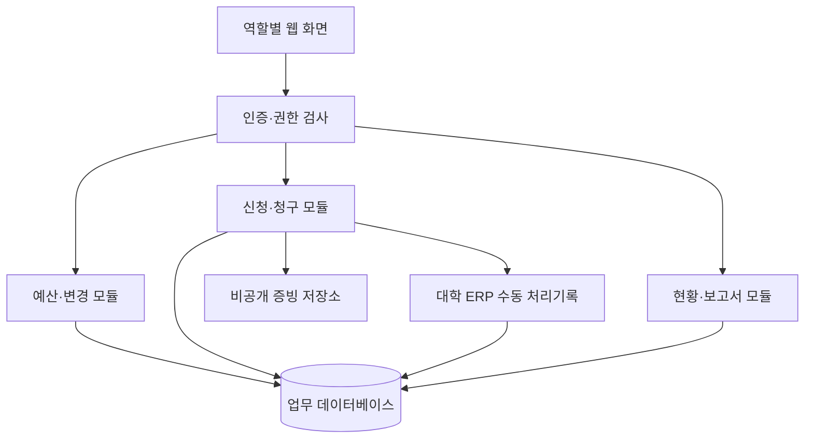

# ERP 전체 구성안

기준일 2026-10-04. 이 문서는 설계 초안이며 구현 완료 보고서가 아니다.

## 1. 목적

산공과제와 비교과의 예산을 항목별로 배정하고, 연구원의 사용신청·청구·증빙을 담당자가 검토한 뒤 대학 산학협력단 ERP에 실청구하여 지급·정산 결과까지 추적한다. 자체 ERP는 사업단 내부 관리와 공식 회계처리를 연결하는 보조 시스템이다.

## 2. 이번 범위

- 과제·프로그램 공통 관리, 유형 구분, 사업연차·기간·재원 구분
- 4종 역할 및 배정 기반 접근권한
- 최초예산·현재예산·변경이력·예산항목별 잔액
- 지출 유형별 사전 사용신청, 공식 사전품의 정보 연결
- 사용 후 청구, 증빙, 보완, 제출본 버전 관리
- 담당자의 대학 ERP 수동 상신과 결과 기록
- 부분 지급·취소·환입·정산 마감
- 현황·출력, 업무 설정, 계정·감사기록, 백업·복구

## 3. 범위 밖

Notion·홈페이지 실연동, 대학 ERP/RCMS/K-PASS 자동 조작·송금, 범용 인사·급여, 전면 자산관리, 모바일 앱, AI 자동 적격 판정, 원본 Notion 수정. 참여자 정보는 청구에 필요한 범위로 시작하며 출결·수료·성과 전체 시스템은 후속 확장이다.

## 4. 기존 Notion에서 계승할 구조

| 현재 구성 | ERP 대응 | 보완 |
|---|---|---|
| 프로젝트 | 과제·프로그램 | 고유 ID, 관리번호, 담당자·책임자 분리 |
| 예산배정 | 예산항목·배정액 | 최초·변경·현재예산과 재원·연차 |
| 예산사용 | 집행 건·청구 | 사전/사후, 증빙·공식 처리·지급 분리 |
| 예산변경요청 | 변경신청과 복수 변경행 | 대상 예산항목 직접 연결, 일괄 반영 |
| 연락처 | 계정·참여자·업무배정 | 연락처 보유와 접근권한 부여 분리 |

기존 값을 수정하거나 실제 데이터의 적정성을 확정하는 작업은 이번 문서 작성에 포함하지 않았다.

## 5. 권고 아키텍처

하나의 웹 애플리케이션 안에서 인증·업무·예산·청구·증빙·보고서를 모듈로 나누는 구조를 권고한다. 초기부터 여러 독립 서버로 분산하지 않는다. 아래 기술은 제안이며 00단계에서 확정한다.

| 영역 | 제안 | 결정 기준 |
|---|---|---|
| 웹·업무 서버 | 1안 Next.js + TypeScript / 대안 Django | 유지보수자의 기술, 배포 환경, 인증 방식 |
| DB | PostgreSQL | 관계 무결성, 금액 처리, 트랜잭션, 백업 |
| 증빙 저장 | 비공개 파일 저장소 + 메타데이터 DB | 서버 변경 시 교체 가능, 다운로드 권한 검사 |
| 로그인 | 기관에서 허용한 계정/SSO 또는 초대형 로컬 계정 | 기관 정책과 운영 접근성; 아직 미확정 |
| 운영 | 개발·시험·운영 분리 | 환경변수, 운영 비밀정보 분리, 복구 가능성 |

Next.js/Django는 웹 애플리케이션 구현 후보이고 PostgreSQL은 트랜잭션을 지원한다. 채택 조합과 정확한 버전은 최신 공식 자료를 확인해 결정기록에 남긴다. 1안과 대안을 동시에 구현하지 않는다.

출처: [Next.js 공식 문서](https://nextjs.org/docs), [Django 개요](https://www.djangoproject.com/start/overview/), [PostgreSQL 트랜잭션](https://www.postgresql.org/docs/current/tutorial-transactions.html). 확인일 2026-10-04.

## 6. 공통 화면

| 화면 | 내용 |
|---|---|
| 대시보드 | 역할별 처리 대기·보완·미지급·잔액 |
| 과제·프로그램 목록/상세 | 개요, 구성원, 예산, 집행 건, 변경, 증빙 탭 |
| 예산 | 항목별 최초/현재예산, 예약액, 순집행액, 가용액 |
| 예산변경 | 신청서와 여러 변경항목, 처리이력 |
| 사용신청·청구 | 계획→청구 이어쓰기, 제출본, 보완, 증빙 |
| 실청구·지급 | 공식 문서번호, 상신 결과, 지급·환입 |
| 정산·보고서 | 마감, 집계, 권한 적용 내보내기 |
| 업무 설정 | 유형·서류·분류·업무 배정, 담당자 관리 |
| 시스템 관리 | 계정·권한·환경·운영, 관리자 관리 |

## 7. 향후 연동 준비만 수행

변경되지 않는 UUID, 생성·수정시각, 명시적인 서비스 함수/API 계약, 파일 저장 추상화, 원본 출처 ID 보관 가능 구조를 둔다. 동기화 화면·웹훅·외부 토큰·연동 스케줄러는 만들지 않는다. 개인 계정 역할을 외부 서비스 공유권한과 자동 동일시하지 않는다.

## 8. 개발 순서

[로드맵](04-roadmap.md)의 00~10단계를 순차 수행한다. 기능 구현이 끝난 뒤가 아니라 금액·권한 기능을 만드는 단계부터 핵심 검수를 수행한다. 이후 08단계에서는 전체 흐름의 회귀·인수검수를 한다.
