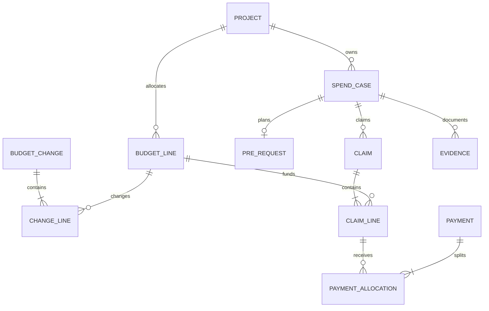

# 데이터·업무 흐름·금액 설계

논리 설계 초안이다. 물리 테이블·인덱스·라이브러리는 00~01단계에서 확정한다.

## 1. 핵심 데이터

| 논리 엔터티 | 주요 내용/관계 |
|---|---|
| 사업·사업연차 | 사업명, 연차, 실제 시작·종료일; 달력연도와 구분 |
| 재원 | 국고·대응자금 등의 분류, 적용 기준·연차 |
| 사용자·참여자·업무배정 | 로그인과 연락처 분리, 과제별 접근 범위 |
| 프로젝트 | 공통 과제·프로그램, 유형, 관리번호, 책임자, 담당자, 기간 |
| 예산 분류 | 공식 분류코드·내부 항목명·기존 Notion 명칭 매핑; 적용일 |
| 예산배정항목 | 프로젝트·사업연차·재원·분류·내부 항목, 최초예산 |
| 예산변경신청/변경행 | 신청서 1개에 대상 예산항목별 변경행 여러 개 |
| 집행 건 | 전체 절차를 묶는 ID, 프로젝트, 신청자, 처리 연구원, 지출 유형 |
| 사전신청/신청버전 | 계획·예정액·일정·참석자·내부 검토, 제출본 |
| 공식 사전품의 기록 | 기관 문서번호, 결재 여부·일자, 확인자, 관련 파일 |
| 청구/청구버전/청구행 | 집행 건 아래 실제 사용액·세부 거래·제출본·검토액 |
| 예산예약/금액이력 | 예산항목별 미지급 확보액과 예약·전환·해제 사건 |
| 실청구기록/연결내역 | 대학 ERP 문서번호, 상신 시도, 반려·재상신, 청구행 배분 |
| 지급기록/지급배분 | 지급일·금액·확인 근거, 연결 청구·예산항목 |
| 환입·정정기록 | 원지급 연결, 금액, 사유, 확인상태, 예산복원 여부 |
| 증빙/파일버전/검토 | 서류종류, 조건, 저장키, 해시, 제출자·검토자·상태 |
| 처리·감사이력 | 주체, 대상, 행위, 전후 값, 사유, 시각, 요청 ID |
| 마감/재개방 | 대상기간·업무, 완료 조건, 해제사유·처리자 |

모든 주요 엔터티에는 고유 ID를 둔다. 내부 이름 변경은 관계를 끊지 않는다. 기존 명칭의 하이픈을 기준으로 공식 비목·세목을 자동 분해하지 않는다. 실적 집계용 내부 항목과 공식 회계 분류를 별도 매핑한다.

## 2. 관계

구현 시 같은 프로젝트의 예산과 청구만 연결되도록 제약을 둔다.

## 3. 상태는 네 축으로 분리

| 축 | 제안 상태 | 처리자 |
|---|---|---|
| 사전신청 | 작성중·검토대기·보완요청·내부검토완료·반려·철회 | 연구원/담당자 |
| 사후청구 | 작성중·검토대기·보완요청·검토확정·반려·철회 | 연구원/담당자 |
| 대학 ERP | 미상신·상신완료·반려·재상신·처리완료·취소 | 담당자 |
| 지급·정산 | 미지급·일부지급·지급완료 / 미마감·마감·재개방 | 담당자 |

공식 사전결재는 별도 문서기록이다. UI는 현재 필요한 작업을 대표 상태로 보여주되, 내부 저장은 위 사실을 분리한다. 담당자의 내부 검토는 공식 승인 권한을 부여하는 것이 아니다.

## 4. 주요 전이 조건

| 행위 | 조건 | 효과 |
|---|---|---|
| 사전신청 제출 | 배정·필수 계획정보 충족 | 제출본 보존, 검토대기 |
| 사전 내부검토 완료 | 권한·유형별 절차·예산 검사 | 예약 기준 D-02에 따른 예약, 검토자 기록 |
| 사후 청구 제출 | 실제 내역·유형별 증빙 조건 충족 | 제출본 보존, 사전신청 연결 유지 |
| 청구 검토확정 | 보완 해결, 조정액·사유, 예산 검사 | 예약액을 기존 예약과 연계해 조정 |
| 실청구 등록 | 청구 검토확정, 공식 처리정보 | 상신 이력 추가; 지급으로 처리하지 않음 |
| 실청구 반려/재상신 | 기존 상신기록 존재 | 시도별 이력 보존, 필요한 청구 재검토 |
| 지급 확인 | 근거·지급액·일자·잔여 청구액 검사 | 지급 기록과 예약 전환을 원자적으로 반영 |
| 취소/환입 | 원거래·사유·실제 반환 확인 | 정정기록 추가, 복원정책에 따라 금액 반영 |
| 마감 | 지급·증빙·공식 처리의 미결정 없음 | 수정 제한, 필요한 정정은 재개방 |

연구원은 작성중 또는 보완 허용 버전만 수정한다. 검토 중 회수는 담당자가 처리 시작하지 않았을 때만 허용하는 것을 제안하며 정책을 확정한다. 상신된 건을 임의 삭제하지 않는다. 담당자가 대행 수정해도 제출 원본과 변경사유를 보존한다.

## 5. 예산 계산

금액은 KRW 정수/정확한 고정소수형. 승인 전 자료, 무효 거래, 중복 수입을 제외한다.

- 현재예산 = 최초예산 + 적용 완료한 변경 증감 합계
- 순집행액 = 확인된 지급액 - 해당 연차·항목에 예산복원 반영이 확정된 취소/환입액
- 집행잔액 = 현재예산 - 순집행액
- 미지급 예약액 = 유효하게 확보한 금액 중 아직 지급되지 않고 취소되지 않은 금액
- 가용액 = 현재예산 - 순집행액 - 미지급 예약액
- 검토 대기 요청액은 별도 표시하고 가용액과 자동 중복 차감하지 않는다.

차년도 반환·국고 반납 등을 모두 현재 가용예산으로 복원하지 않는다. 환입의 현금 흐름과 예산복원 효과를 구분하고 D-09 기준을 확정한다.

### 가상 예시

| 사건 | 현재예산 | 순집행액 | 예약액 | 가용액 |
|---|---:|---:|---:|---:|
| 시작 | 10,000,000 | 0 | 0 | 10,000,000 |
| 사전계획 1,000,000원 예약 | 10,000,000 | 0 | 1,000,000 | 9,000,000 |
| 최종 청구 900,000원 확정, 미사용 100,000원 해제 | 10,000,000 | 0 | 900,000 | 9,100,000 |
| 400,000원 부분 지급 | 10,000,000 | 400,000 | 500,000 | 9,100,000 |
| 나머지 500,000원 지급 | 10,000,000 | 900,000 | 0 | 9,100,000 |
| 같은 연차 100,000원 환입 및 복원 확정 | 10,000,000 | 800,000 | 0 | 9,200,000 |

여러 청구를 포함하는 집행 건은 일부 청구 확정 때 잔여 사전예약을 전부 해제하지 않는다. 추가 청구 예정분을 유지하고, 최종청구/집행 종료 시점에 확인 후 해제한다. 단일 최종청구 기본 UI와 다중청구 데이터 지원 범위는 D-08에서 결정한다.

## 6. 예산변경

변경신청에 여러 변경행을 묶고 대상 예산항목 ID·변경전 버전·증감·변경후 금액을 저장한다. 항목 간 조정은 합계 0을 검사한다. 총예산 증감·재원 전환·이월은 별도 유형·근거로 처리한다. 감액 후 금액이 순집행액+예약액보다 작으면 차단 또는 별도 승인된 조정 절차로 보낸다. 승인에 필요한 공식 문서는 기록하되 시스템 자체가 승인 권한을 만들어내지 않는다.

변경확정·원장반영·감사기록은 한 트랜잭션으로 처리하고 중복 실행 키를 둔다. 제출 후 예산이 바뀌면 낡은 변경전 금액을 그대로 적용하지 않는다.

## 7. 거래·파일·동시성

- 청구서 표지와 세부 지출행을 구분한다. 묶음 영수증·여러 거래가 있으면 행별 금액·지급대상·예산배정을 남긴다.
- 초기 UI는 한 청구에 한 예산항목을 기본으로 하되 세부행·배분 모델을 둔다. 여러 재원/항목에 분할하는 UI는 D-08 이후 범위를 정한다.
- 한 대학 ERP 문서가 여러 청구를 묶거나 한 청구를 나누는 경우를 위해 실청구 연결 테이블을 둔다. 실제 사용 방식은 00단계에서 확인한다.
- 지급대상자의 실수령액만으로 예산집행액을 계산하지 않는다. 원천징수 등 분할이 있으면 총액·실수령액·공제/별도납부 배분을 대조한다. 세액 자동산출은 현 범위 밖이다.
- 예산 부족 검사와 예약 기록을 같은 DB 트랜잭션에서 직렬화/잠금·버전 확인으로 보호한다. 단순 화면 잔액 검사는 충분하지 않다.
- 중복 상신/지급확인/이관은 고유 요청 ID·원본 ID로 식별한다. 재시도는 기존 결과를 반환한다.
- 파일 바이너리는 DB와 분리해 비공개 저장하고, 메타데이터와 해시·접근권한·버전을 연결한다. ZIP은 자동 실행·무제한 압축해제하지 않는다.
- 파일 업로드와 DB 저장 실패를 구분하고 고아 파일 정리 정책을 둔다. 정리로 승인된 증빙이 소실되지 않게 한다.
